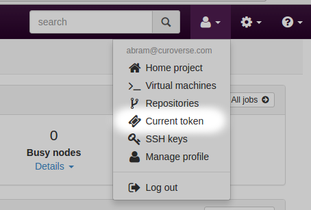
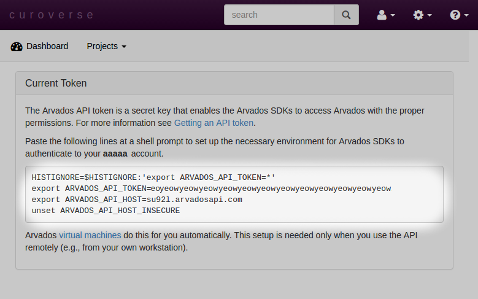

Unofficial Arvados Keep Mount Installation
---

This is an unofficial small tutorial on how to get an Arvados Keep
mount installed under a Unix shell.  Please see the 

There are a few key things to setup to get a working Arvados mount going.

* [Sign up for Arvados/Get an Arvados account](https://workbench.su92l.arvadosapi.com)
* Install Arvados command line interface/tools
* Setup environment variables
* Create the Keep mount point

## Sign up for an Arvados Account

If you don't already have one, [sign up for an Arvados account](https://workbench.su92l.arvadosapi.com).

## Install Arvados Commend Line Interface and Tools

### Install dependencies

Some of these might be redundant

```bash
sudo apt-get -y install \
    bison build-essential gettext libcurl3 libcurl3-gnutls \
    libcurl4-openssl-dev libpcre3-dev libreadline-dev \
    libssl-dev libxslt1.1 zlib1g-dev \
    libfuse-dev battr1-dev \
    python-dev python-setuptools python-fuse python-llfuse python-lockfile python-docutils \
    ruby
```
### Install Arvados source tree

Clone the Arvados repository, install the Arvados fuse libraries

```bash
git clone https://github.com/curoverse/arvados
cd arvados/services/fuse/
sudo addgroup `whoami` fuse
sudo python setup.py install
```

Now `arv-mount` should be available.  This won't work until you've set up your environment
with the Arvados token and host.  You should test to make sure `arv-mount` can be executed
within the shell.  For example, this is what running `arv-mount` without any arguments looks
like:

```bash
~$ arv-mount 
usage: arv-mount [-h] [--retries RETRIES] [--allow-other]
                 [--all | --custom | --home | --shared | --by-tag | --by-id | --by-pdh | --project UUID | --collection UUID_or_PDH]
                 [--mount-by-pdh PATH] [--mount-by-id PATH]
                 [--mount-by-tag PATH] [--mount-home PATH]
                 [--mount-shared PATH] [--mount-tmp PATH] [--debug]
                 [--logfile LOGFILE] [--foreground] [--encoding ENCODING]
                 [--file-cache FILE_CACHE] [--directory-cache DIRECTORY_CACHE]
                 [--read-only] [--read-write]
                 [--crunchstat-interval CRUNCHSTAT_INTERVAL]
                 [--unmount-timeout UNMOUNT_TIMEOUT] [--exec ...]
                 mountpoint
arv-mount: error: too few arguments
``

### Setup Arvados Environment

When logged into the Arvados `workbench` [web site](https://workbench.su92l.arvadosapi.com) with
your Arvados account, go to the 'Current token` as listed in the account dropdown:



Once on the `Current token` page, you should see commands to execute on the command line
to setup the Arvados environment.  The two most relevant lines are setting the `ARVADOS_API_TOKEN`
and `ARVADOS_API_HOST`, indicating which secret token to use to login and which host to connect
to respectively.  These environment variables are used by the Arvados CLI tools to know which
host to connect to and for authentication:



For redundancies sake, here is an example of the relevant lines to paste into your shell:

```bash
HISTIGNORE=$HISTIGNORE:'export ARVADOS_API_TOKEN=*'
export ARVADOS_API_TOKEN=eoyeowyeowyeowyeowyeowyeowyeowyeowyeowyeowyeowyeow
export ARVADOS_API_HOST=su92l.arvadosapi.com
unset ARVADOS_API_HOST_INSECURE
```

Note that the `ARVADOS_API_TOKEN` listed above is not a valid token and you should
fill this value in with the token as it appears in the `Current token` page from
Arvados workbench.

## Create Arvados Keep Mount Point

Now that the Arvados tools are installed and the environment is setup, the Arvados Keep
mount is ready to be created.  From a directory of your choice and using a shell
where the Arvados environment has been set up (`ARVADOS_API_TOKEN` and `ARVADOS_API_HOST`
should both be accessible by the shell in question), execute the following command:

```
mkdir -p keep
arv-mount keep
```

This will set up a directory `keep` and mount it.  You should now be able to look around in the
`keep` directory.  For example:

```
~$ cd keep
~/keep$ ls
by_id  by_tag  home  README  shared
```

Note that by default the keep mount is read-only.  Access to files in the keep mount will
be communicating to Arvados over the network.  If a local copy is desired, doing a simple copy (e.g. `cp`)
from the keep mount to a local directory should suffice.

There is also an Arvados CLI tool called `arv-get` to get files from an Arvados Keep store.  For example,
assuming the Arvados environment is set up properly (`ARVADOS_API_HOST` and `ARVADOS_API_TOKEN` are both
set under the shell in question), the following would work to download a file by using it's UUID:

```
~$ arv-get su92l-4zz18-mgutzl97gub8njv/untap.db .
```

Alternatively, you could use the content address (also called the "portable data hash"):

```
~$ arv-get c7dd15c98fe90432c97851fc89fc1d7a+3387/untap.db .
```

Sometimes `arv-get` is faster than using the Arvados mount.

## Tearing Down the Arvados Keep Mount

Once finished, you can tear down the connection to the Arvados Keep service by issuing:

```bash
fusermount -u keep
```

References
---

* [Arvados CLI Installation](http://doc.arvados.org/sdk/cli/install.html)
* [Arvados Keep Mount Tutorial](http://doc.arvados.org/user/tutorials/tutorial-keep-mount.html)
* [Arvados Environment](http://doc.arvados.org/user/getting_started/check-environment.html)
